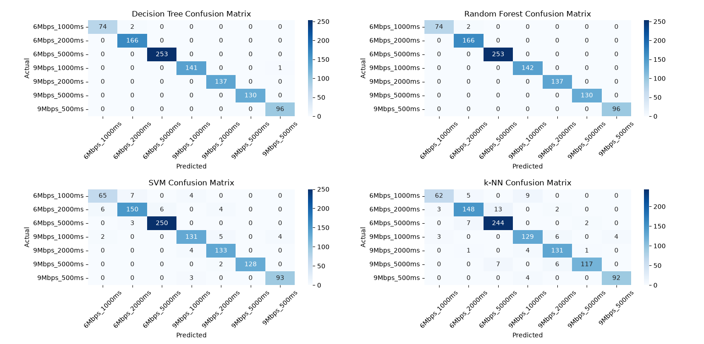

# Experimental Results & Performance Analysis

This document provides a detailed breakdown of the evaluation results obtained from running the V2V Transmission Scheduling Optimizer proof-of-concept pipeline (`script.py`).

---

## 📊 Summary Performance Metrics

The evaluated models were assessed across three key criteria:
1. **Accuracy**: Overall classification correctness across all target configurations.
2. **Macro F1-Score**: Unweighted mean of F1-scores across all classes, accounting for class imbalance.
3. **Inference Latency ($\mu\text{s/sample}$)**: Per-sample prediction processing time in microseconds.

### Benchmark Evaluation Table

| Model | Accuracy | Macro F1-Score | Latency ($\mu\text{s/sample}$) |
| :--- | :---: | :---: | :---: |
| **Random Forest** | **0.998** | **0.997240** | 16.2735 |
| **Decision Tree** | 0.997 | 0.995995 | **1.4328** |
| **SVM (RBF Kernel)** | 0.950 | 0.942883 | 171.5221 |
| **k-Nearest Neighbors (k-NN)** | 0.923 | 0.918495 | 6.7439 |

---

## 🔍 Detailed Model Analysis

### Confusion Matrix Overview

---

### 1. Decision Tree
- **Accuracy**: $99.7\%$
- **Macro F1-Score**: $0.9960$
- **Inference Latency**: $1.43\text{ }\mu\text{s/sample}$
- **Matrix Performance**:
  - Almost perfect classification across all classes.
  - Only $2$ misclassifications between `6Mbps_1000ms` and `6Mbps_2000ms`.
  - $1$ minor misclassification in `9Mbps_1000ms` predicted as `9Mbps_500ms`.
- **Takeaway**: Offers near-optimal accuracy while delivering the lowest latency ($1.43\text{ }\mu\text{s}$), making it the most suitable candidate for real-time On-Board Unit (OBU) embedded deployment.

### 2. Random Forest
- **Accuracy**: **$99.8\%$** (Highest)
- **Macro F1-Score**: **$0.9972$** (Highest)
- **Inference Latency**: $16.27\text{ }\mu\text{s/sample}$
- **Matrix Performance**:
  - Highest precision across all target configurations.
  - Nearly identical confusion matrix to Decision Tree, with minimal misclassifications ($2$ instances in `6Mbps_1000ms` predicted as `6Mbps_2000ms`).
- **Takeaway**: Provides the robust performance expected from ensemble methods, though with a $\approx 11\times$ increase in inference latency compared to a single Decision Tree.

### 3. Support Vector Machine (SVM)
- **Accuracy**: $95.0\%$
- **Macro F1-Score**: $0.9429$
- **Inference Latency**: $171.52\text{ }\mu\text{s/sample}$ (Highest)
- **Matrix Performance**:
  - Noticeable misclassifications along boundary conditions (e.g., $7$ instances of `6Mbps_1000ms` predicted as `6Mbps_2000ms`, $4$ predicted as `9Mbps_1000ms`).
  - Dispersion across `9Mbps_1000ms` ($2$ misclassified as `6Mbps_1000ms`, $5$ as `9Mbps_2000ms`, $4$ as `9Mbps_500ms`).
- **Takeaway**: RBF kernel computational cost scales poorly for real-time inference ($171.52\text{ }\mu\text{s}$), making it less practical for latency-critical V2V applications.

### 4. k-Nearest Neighbors (k-NN)
- **Accuracy**: $92.3\%$
- **Macro F1-Score**: $0.9185$
- **Inference Latency**: $6.74\text{ }\mu\text{s/sample}$
- **Matrix Performance**:
  - Highest rate of misclassifications near boundary thresholds.
  - Significant overlap between `6Mbps_2000ms` and `6Mbps_5000ms` ($13$ samples misclassified as `6Mbps_5000ms`).
  - $7$ instances of `6Mbps_5000ms` misclassified as `6Mbps_2000ms`.
- **Takeaway**: While fast ($6.74\text{ }\mu\text{s}$), distance-based search degrades in accuracy around tight multi-feature decision boundaries.

---

## 💡 Practical Implications for V2V Systems

1. **Trade-off between Accuracy and Real-Time Safety**:
   - In V2V safety contexts (IEEE 802.11p / C-V2X), safety messages (BSMs/CAMs) require low processing delay.
   - **Decision Tree** emerges as the optimal compromise: it achieves **$99.7\%$ accuracy** within **$1.43\text{ }\mu\text{s}$**, easily satisfying real-time OBU processing budgets.

2. **Boundary Sensitivity**:
   - The primary source of error across all models occurs at decision boundaries between adjacent interval configurations (e.g., switching between `1000ms` and `2000ms`). Smoothing or hysteresis filters could further reduce oscillations at these boundaries.